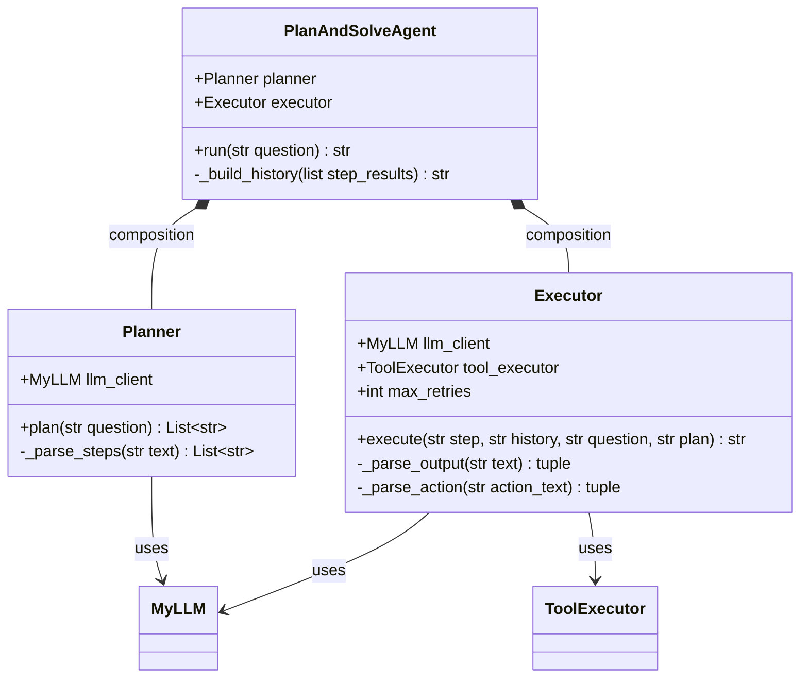
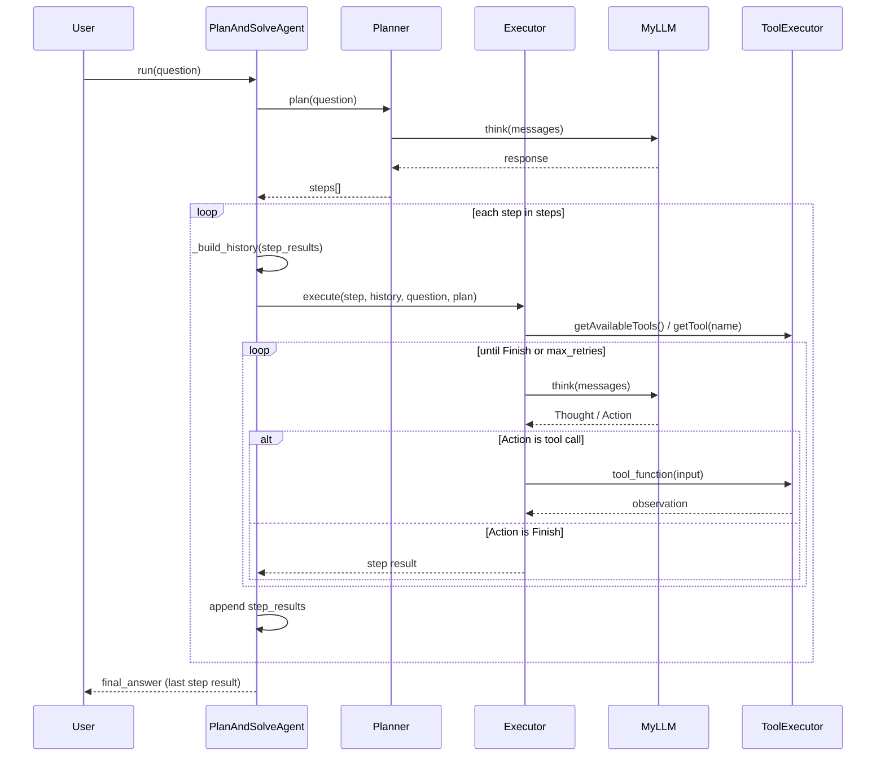

## 前言
在上篇中尝试了ReAct范式的agent结构，这次进一步试一下Plan-and-Solve这种现在更多被使用的结构。完整的代码可以在[这里](https://github.com/vingoh/Agent-Demo/blob/df77bc5619ce325b8fd12b3bedb70e84d66cfb1f/plan_and_solve_agent.py)找到。

## 代码结构
本次不完全根据Hello-Agents中的教程来，而是更多在自己的理解上进行设计和开发，当然，在开发上很大程度借助了agent。

现有结构的类图和时序图如下：





### Planner
Planner的结构比较简单，基本上不需要太多的改动，只需要在prompt上下点功夫，约定好输出的plan格式即可，整体代码如下：

```python!
PLANNER_PROMPT_TEMPLATE = """
你是一个任务规划专家。你的职责是将用户的复杂问题拆解为一系列清晰、可执行的子步骤。

请严格按照以下格式输出你的计划，每个步骤占一行:
Step 1: <第一步要做的事情>
Step 2: <第二步要做的事情>
...
Step N: 根据以上所有步骤的结果，汇总并给出最终答案。

要求:
- 每个步骤应当是独立、具体、可执行的。
- 最后一个步骤必须是"汇总并给出最终答案"。
- 步骤数量应当合理，不要过多也不要过少（通常2-5步）。

用户的问题是:
{question}
"""

class Planner:
    """
    计划器：接收用户问题，调用 LLM 生成结构化的多步骤执行计划。
    """

    def __init__(self, llm_client: MyLLM):
        self.llm_client = llm_client

    def plan(self, question: str) -> List[str]:
        """
        将用户问题分解为有序的子步骤列表。
        """
        print("[PLANNER][START] 正在为问题生成计划...")
        prompt = PLANNER_PROMPT_TEMPLATE.format(question=question)
        messages = [{"role": "user", "content": prompt}]
        response = self.llm_client.think(messages=messages)

        if not response:
            print("[PLANNER][ERROR] LLM 未能返回有效的计划。")
            return []

        steps = self._parse_steps(response)
        print(f"[PLANNER][DONE] 共生成 {len(steps)} 个步骤:")
        for i, step in enumerate(steps, 1):
            print(f"  Step {i}: {step}")
        return steps

    def _parse_steps(self, text: str) -> List[str]:
        """从 LLM 输出中提取 Step N: ... 格式的步骤。"""
        matches = re.findall(r"Step\s+\d+[:：]\s*(.+)", text)
        return [m.strip() for m in matches if m.strip()]

```

### Executor

Executor方面做了一些改动，首先与教程中一个主要的不同是，教程中给的简易demo没有给executor添加任何tool calling功能，这里加上了。

其次对于executor的执行step，教程中使用的是每次单迭代。但是在有tool calling的流程中这肯定是不够的，因此给每个执行阶段加入了sub step，即每个plan中的step相当于一次ReAct的执行流程。Prompt也做出了相应的修改，把教程中的prompt和ReAct所需的tool相关的prompt融合在了一起。

整体代码如下：

```python!

EXECUTOR_PROMPT_TEMPLATE = """
你是一个任务执行专家。你需要完成当前子任务，同时理解它在整体计划中的位置。

用户的原始问题:
{question}

整体执行计划:
{plan}

当前子任务:
{step}

前序步骤的执行历史:
{history}

可用工具如下:
{tools}

请严格按照以下格式回应:
Thought: 你的思考过程，分析当前子任务需要怎么做。
Action: 你决定采取的行动，必须是以下格式之一:
- `{{tool_name}}[{{tool_input}}]`: 调用一个可用工具来获取信息。
- `Finish[结果]`: 当你已经能够给出当前子任务的结果时。

注意:
- 如果当前子任务可以通过执行历史中的信息直接回答，请直接使用 Finish[结果]。
- 如果需要查询外部信息，请先调用工具，再根据工具返回的结果给出 Finish[结果]。
"""

class Executor:
    """
    执行器：逐个执行子任务，按需调用工具，返回每步的执行结果。
    """

    def __init__(self, llm_client: MyLLM, tool_executor: ToolExecutor, max_retries: int = 3):
        self.llm_client = llm_client
        self.tool_executor = tool_executor
        self.max_retries = max_retries

    def execute(self, step: str, history: str, question: str, plan: str) -> str:
        """
        执行单个子任务。可能经历"调用工具 -> 获取观察 -> 总结结果"的过程。
        """
        print(f"[EXECUTOR][START] 正在执行子任务: {step}")
        tools_desc = self.tool_executor.getAvailableTools()

        prompt = EXECUTOR_PROMPT_TEMPLATE.format(
            question=question,
            plan=plan,
            step=step,
            history=history if history else "（暂无历史记录，这是第一个步骤）",
            tools=tools_desc,
        )
        messages = [{"role": "user", "content": prompt}]

        for attempt in range(1, self.max_retries + 1):
            tag = f"[EXECUTOR][ATTEMPT {attempt}]"
            response = self.llm_client.think(messages=messages)

            if not response:
                print(f"{tag} LLM 未能返回有效响应。")
                continue

            thought, action = self._parse_output(response)

            if thought:
                print(f"{tag}[THOUGHT] {thought}")

            if not action:
                print(f"{tag}[WARN] 未能解析出有效的 Action。")
                continue

            print(f"{tag}[ACTION] {action}")

            if action.startswith("Finish"):
                finish_match = re.match(r"Finish\[(.*)\]", action, re.DOTALL)
                if finish_match:
                    result = finish_match.group(1).strip()
                    print(f"[EXECUTOR][DONE] {result}")
                    return result
                print(f"{tag}[WARN] Finish 格式无效: {action}")
                continue

            tool_name, tool_input = self._parse_action(action)
            if not tool_name:
                print(f"{tag}[WARN] Action 格式无效，重试。")
                continue

            tool_function = self.tool_executor.getTool(tool_name)
            if not tool_function:
                observation = f"错误: 未找到名为 '{tool_name}' 的工具。"
            else:
                print(f"{tag}[TOOL_CALL] {tool_name}[{tool_input}]")
                observation = tool_function(tool_input)

            print(f"{tag}[OBSERVATION] {observation}")

            messages.append({"role": "assistant", "content": response})
            messages.append({"role": "user", "content": f"Observation: {observation}\n\n请根据以上观察结果，给出当前子任务的最终结果，使用 Finish[结果] 格式。"})

        print("[EXECUTOR][FAIL] 达到最大重试次数，未能完成子任务。")
        return "（该步骤未能成功执行）"

    def _parse_output(self, text: str):
        thought_match = re.search(r"Thought:\s*(.*?)(?=\nAction:|$)", text, re.DOTALL)
        action_match = re.search(r"Action:\s*(.*?)$", text, re.DOTALL)
        thought = thought_match.group(1).strip() if thought_match else None
        action = action_match.group(1).strip() if action_match else None
        return thought, action

    def _parse_action(self, action_text: str):
        match = re.match(r"(\w+)\[(.*)\]", action_text, re.DOTALL)
        if match:
            return match.group(1), match.group(2)
        return None, None


```

具体代码实现方面有一个小点，是之前没怎么注意到的。message是在循环外部定义，在循环内部持续追加。这意味着当llm选择调用工具后，工具的观察结果会以多轮对话的形式累积进去，下一轮llm调用能看到完整的交互历史。但是和react demo中直接通过字符串拼接的做法不同，这里用了OpenAI原生的assistant/user 多轮对话结构。这样做语义更加清晰，语义更清晰，llm能更好地理解"我之前说了什么、工具返回了什么"的上下文关系。

此外，还是有一个之前也注意到的问题，这样无脑的追加上下文，当迭代次数过多或者内容复杂时，势必造成llm能力的劣化，不能很好的注意到所有要点。在某些特定情况下，比如迭代次数或者上下文内容超过某个阈值，需要应用一些上下文压缩的方法。

### PlanAndSolveAgent

是直接的调用类，但并不直接持有llm类，只对planner和executor进行调度编排。主要的作用是调用planner，获取执行计划传给executor，以及对历史执行结果的解析和记录，作为记忆输入给executor。

```python!

class PlanAndSolveAgent:
    """
    Plan-and-Solve 智能体（v2）：先通过 Planner 生成计划，再通过 Executor 逐步执行，
    最后一个步骤的输出即为最终答案（无需额外的 summarize 阶段）。
    """

    def __init__(self, planner: Planner, executor: Executor):
        self.planner = planner
        self.executor = executor

    def run(self, question: str) -> str:
        print(f"[AGENT][START] Question: {question}")

        # 阶段一：生成计划
        steps = self.planner.plan(question)
        if not steps:
            print("[AGENT][ERROR] 计划生成失败，流程终止。")
            return None

        # 阶段二：逐步执行，最后一步的结果即为最终答案
        plan_str = "\n".join(f"Step {i}: {s}" for i, s in enumerate(steps, 1))
        step_results = []
        for i, step in enumerate(steps, 1):
            print(f"\n{'='*60}")
            print(f"[AGENT][EXECUTE] Step {i}/{len(steps)}: {step}")
            print(f"{'='*60}")

            history = self._build_history(step_results)
            result = self.executor.execute(step, history, question=question, plan=plan_str)
            step_results.append({"step": step, "result": result})
            print(f"[AGENT][STEP {i} RESULT] {result}")

        final_answer = step_results[-1]["result"]
        print(f"\n[AGENT][FINAL ANSWER] {final_answer}")
        return final_answer

    def _build_history(self, step_results: list) -> str:
        """将已完成步骤及其结果格式化为历史记录字符串。"""
        if not step_results:
            return ""
        lines = []
        for i, sr in enumerate(step_results, 1):
            lines.append(f"Step {i}: {sr['step']}")
            lines.append(f"Result: {sr['result']}")
            lines.append("")
        return "\n".join(lines)
```

## 调用结果

同样的以`英伟达最新的GPU型号是什么？它相比上一代有哪些提升？`作为输入问题，观察agent每步运行步骤以及最终结果有什么不同。

首先看生成的计划：

> Step 1: 检索并确认英伟达（NVIDIA）目前最新一代的旗舰GPU型号及其核心架构信息。
> Step 2: 查找并提取该最新GPU在核心规格、显存配置、AI算力（TOPS/TFLOPS）以及独家技术支持等方面的具体参数。
> Step 3: 对比分析上述参数与上一代旗舰GPU，总结出在性能、能效比和新增功能上的具体提升点。
> Step 4: 根据以上所有步骤的结果，汇总并给出最终答案。

中间过程中基本上执行1到2个attempts就会提前输出Finish结束当前step，不太会触发max_iter，当然也可能跟任务比较简单有关。最终结果如下：

> 英伟达（NVIDIA）目前最新一代的旗舰GPU包括数据中心级的B200和消费级的GeForce RTX 5090，它们均基于最新的“Blackwell”核心架构。相比上一代，它们在性能、能效比和新增功能上实现了巨大飞跃，具体提升如下：
> 
> **1. 消费级旗舰：GeForce RTX 5090（对比上一代 RTX 4090）**
> *   **性能提升**：
>     *   **AI与图形算力**：AI算力飙升至2375 TOPS，在本地大模型运行、光线追踪及现代API游戏中的表现显著优于RTX 4090。
>     *   **显存跨越**：显存从24GB GDDR6X升级为32GB GDDR7，带宽从1008 GB/s跃升至约1792 GB/s，彻底打破高分辨率下的显存瓶颈。
> *   **能效比**：尽管旗舰级功耗传闻从450W上升至600W，但得益于Blackwell架构优化与GDDR7显存，其每瓦性能（能效比）依然实现了显著提升。
> *   **新增功能**：引入了全新的**DLSS 4**技术，重点新增了“AI多帧生成”功能，能够在极低延迟下成倍提升游戏帧率。
> 
> **2. 数据中心级旗舰：B200（对比上一代 H100）**
> *   **性能提升**：
>     *   **AI算力革命**：在FP4精度下算力高达20 Petaflops，AI大模型推理速度最高可达上一代Hopper架构（H100）的30倍。
>     *   **显存升级**：显存从80GB HBM3跨越式升级为192GB HBM3e，带宽高达8 TB/s，轻松应对万亿参数级别的AI大模型。
> *   **能效比**：在处理超大规模AI模型时，B200的总吞吐量和每瓦性能远超上一代，大幅降低了大型数据中心的运营成本。
> *   **新增功能**：采用了革命性的**双芯片封装设计**（将两块Blackwell芯片作为统一GPU运行）；引入了第二代Transformer引擎和全新的FP4精度支持；并首次加入了机密计算功能以增强AI数据安全性。
