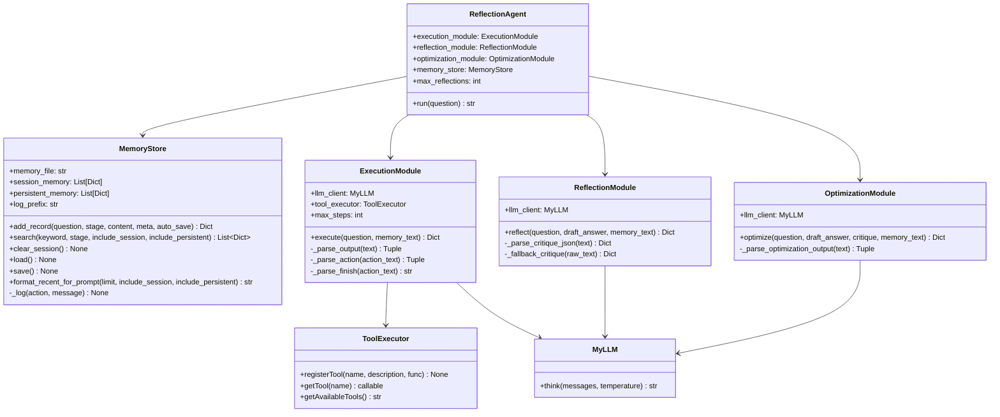
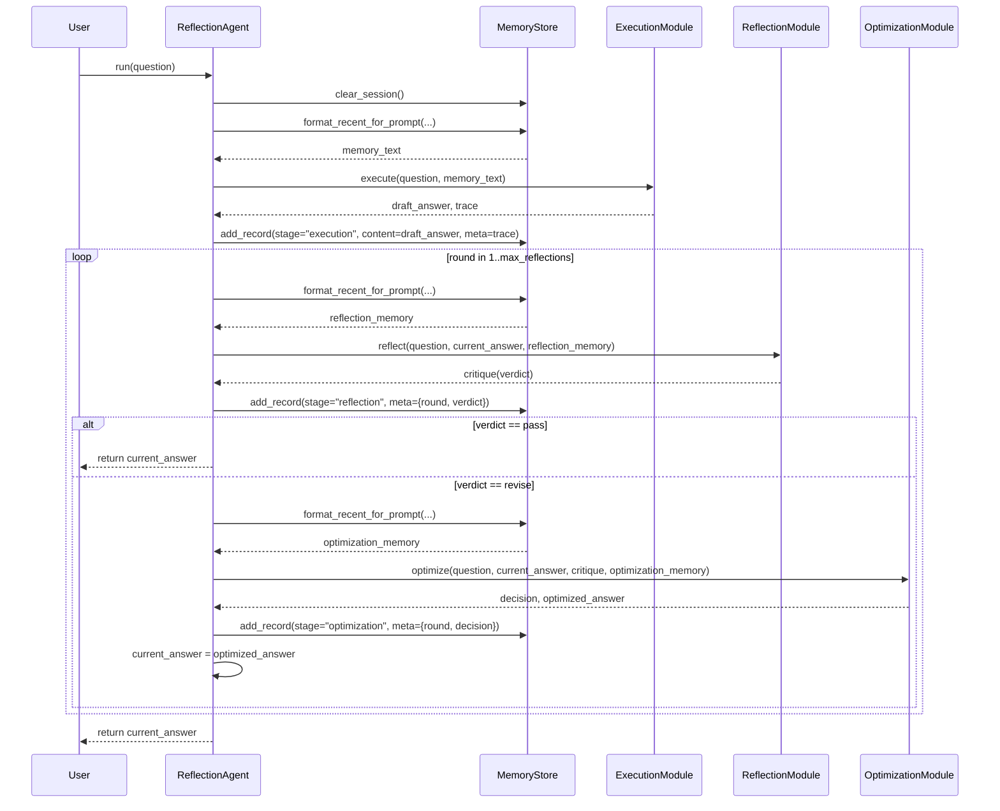

## 前言

这章来看最后一个打算写的常见范式，reflection。与前两者的区别在于加入了一个用于review的子agent，负责对整体回答/操作质量的把控。这算不算有一点harness的早期雏形了。

## 代码结构

首先看类图：



reflection类中主要由三个子agent模块以及一个记忆模块组成。

三个子agent模块分别是execution, reflection, optimization。Execution模块与之前的类似，采用ReAct架构，具有工具调用的能力。Reflection负责执行结果的反馈，并不直接完成任何任务，在这里也没有添加工具调用能力。优化模块类似于执行模块，但这里简化成只根据reflection的结果做一次重写，所以同样不调用任何工具。但是三者都有与记忆模块的交互，三者都会在执行时将记忆模块给出的内容插入context中，并在执行完成后更新一次记忆。

记忆模块具体来看，首先分成了长短期记忆，即这里的persistent/session memory，二者除了语义上的不同，还有一个区别是存储方式的不同，长期记忆被直接写入了一个json文件中存储。此外也实现了一些必须的功能，比如记忆的读取写出（长期文件，短期变量）、清空、以及一个留了接口还没想好怎么用的搜索功能。

具体执行流程图如下：



流程上先执行一次execution模块，得到初步的答案，之后在reflection和optimization中循环，直到达到最大次数或reflection输出了关键字pass。并在每一步的前后加入了对记忆的读取，以保持回答的一致性或减少重复操作。

## Memory代码实现
由于几个子模块与之前的实现较为类似，这里不再重复分析，主要看一下memory模块的实现，代码如下：

```python
class MemoryStore:
    """
    独立记忆模块:
    - session_memory: 当前进程内短时记忆
    - persistent_memory: 本地 JSON 文件持久化记忆
    """

    def __init__(self, memory_file: str = "./memory/reflection_memory.json"):
        self.memory_file = memory_file
        self.session_memory: List[Dict[str, Any]] = []
        self.persistent_memory: List[Dict[str, Any]] = []
        self.log_prefix = "[MEMORY]"
        self.load()
```

这里使用了session_memory保存短期记忆，只能维护单次运行内的记忆；persistent_memory保存长期记忆，可以通过临时文件，跨轮读取记忆。这其实比[文中](https://datawhalechina.github.io/hello-agents/#/./chapter4/%E7%AC%AC%E5%9B%9B%E7%AB%A0%20%E6%99%BA%E8%83%BD%E4%BD%93%E7%BB%8F%E5%85%B8%E8%8C%83%E5%BC%8F%E6%9E%84%E5%BB%BA?id=_442-%e6%a1%88%e4%be%8b%e8%ae%be%e5%ae%9a%e4%b8%8e%e8%ae%b0%e5%bf%86%e6%a8%a1%e5%9d%97%e8%ae%be%e8%ae%a1)提到的长短期记忆都要高了一个维度，当然这更多是设计方面的选择。

```python
    def _log(self, action: str, message: str):
        print(f"{self.log_prefix}[{action}] {message}")

    def add_record(
        self,
        question: str,
        stage: str,
        content: str,
        meta: Optional[Dict[str, Any]] = None,
        auto_save: bool = True,
    ) -> Dict[str, Any]:
        """
        添加一条记忆记录，同时写入短时层和持久层。
        """
        record = {
            "timestamp": datetime.now().isoformat(timespec="seconds"),
            "question": (question or "").strip(),
            "stage": (stage or "").strip(),
            "content": (content or "").strip(),
            "meta": meta or {},
        }
        self.session_memory.append(record)
        self.persistent_memory.append(record)
        self._log(
            "ADD",
            (
                f"stage={record['stage']} content_len={len(record['content'])} "
                f"session_count={len(self.session_memory)} "
                f"persistent_count={len(self.persistent_memory)} auto_save={auto_save}"
            ),
        )

        if auto_save:
            self.save()

        return record
```

以上是实际写入记忆的函数，每条记录会按照以下结构进行记录：

```
{
  "timestamp": "2026-04-12T21:30:00",
  "stage": "execution",
  "question": "英伟达最新GPU是什么？",
  "content": "初稿：最新是 RTX 50 系列..."
}
```

这里实际存在的问题是长短期记忆以完全相同的频次记录了完全相同的内容，但实际上长期记忆应该要存储更为重要、核心的内容且以更精简的方式存储，并且存储的频次也理应更低，或定期对记忆做筛选与压缩，是一个待优化的地方。

```python
    def search(
        self,
        keyword: str,
        stage: Optional[str] = None,
        include_session: bool = True,
        include_persistent: bool = True,
    ) -> List[Dict[str, Any]]:
        """
        按关键字（可选阶段）检索记忆。
        """
        keyword = (keyword or "").strip().lower()
        stage = (stage or "").strip()
        if not keyword and not stage:
            self._log("SEARCH", "keyword/stage both empty, returned=0")
            return []

        sources: List[Dict[str, Any]] = []
        if include_session:
            sources.extend(self.session_memory)
        if include_persistent:
            sources.extend(self.persistent_memory)

        results: List[Dict[str, Any]] = []
        for record in sources:
            content = str(record.get("content", "")).lower()
            question = str(record.get("question", "")).lower()
            record_stage = str(record.get("stage", ""))

            keyword_hit = (not keyword) or (keyword in content or keyword in question)
            stage_hit = (not stage) or (record_stage == stage)
            if keyword_hit and stage_hit:
                results.append(record)
        self._log(
            "SEARCH",
            (
                f"keyword={'<empty>' if not keyword else keyword} "
                f"stage={'<any>' if not stage else stage} "
                f"sources_count={len(sources)} matched={len(results)}"
            ),
        )
        return results
```

以上是记忆检索的功能，主要是通过关键字keyword对加载进来的记忆进行直接匹配。如果在某条记忆记录中匹配到关键字，则将此条记忆结果返回。

但目前还没有在主流程中进行调用。其中一个原因是keyword的选择方式没有确定，如果像react中类似的操作加入一个sub agent生成关键字，似乎有点大炮打蚊子；直接用规则提取关键字似乎又不够鲁棒。后续需要进一步优化后才能将记忆搜索功能接入主流程中，或许可以学习一下[memsearch](https://github.com/zilliztech/memsearch)的实现方式，看看有没有什么灵感。

```python

    def clear_session(self):
        """
        清空本次运行短时记忆，不影响持久层。
        """
        before = len(self.session_memory)
        self.session_memory = []
        self._log("CLEAR_SESSION", f"before={before} after=0")
```

只对短期记忆又clear操作，长期记忆的临时文件需要用户手动维护。

```python
    def load(self):
        """
        从持久化文件加载记忆。
        文件不存在时静默初始化为空列表。
        """
        if not os.path.exists(self.memory_file):
            self.persistent_memory = []
            self._log("LOAD", f"file_not_found path={self.memory_file} initialized_empty")
            return

        try:
            with open(self.memory_file, "r", encoding="utf-8") as f:
                data = json.load(f)
            if isinstance(data, list):
                self.persistent_memory = data
                self._log("LOAD", f"path={self.memory_file} loaded={len(self.persistent_memory)}")
            else:
                self._log("WARN", "memory file content is not a list. reset to empty.")
                self.persistent_memory = []
        except Exception as e:
            self._log("WARN", f"failed to load memory file path={self.memory_file}: {e}")
            self.persistent_memory = []

    def save(self):
        """
        将持久层记忆写入本地文件。
        """
        try:
            parent_dir = os.path.dirname(self.memory_file)
            if parent_dir:
                os.makedirs(parent_dir, exist_ok=True)

            with open(self.memory_file, "w", encoding="utf-8") as f:
                json.dump(self.persistent_memory, f, ensure_ascii=False, indent=2)
            self._log("SAVE", f"path={self.memory_file} saved={len(self.persistent_memory)}")
        except Exception as e:
            self._log("ERROR", f"failed to save memory file path={self.memory_file}: {e}")
```

对长期记忆的读取与存储功能，基本上没有做太多额外的优化，是直接把persistent_memory变量写入到临时文件中，读取也是直接读取。

```python
    def format_recent_for_prompt(
        self,
        limit: int = 5,
        include_session: bool = True,
        include_persistent: bool = True,
    ) -> str:
        """
        将近期记忆格式化为提示词可用文本。
        """
        records: List[Dict[str, Any]] = []

        if include_persistent:
            records.extend(self.persistent_memory[-max(limit, 0) :])
        if include_session:
            records.extend(self.session_memory[-max(limit, 0) :])

        self._log(
            "FORMAT",
            (
                f"limit={max(limit, 0)} include_session={include_session} "
                f"include_persistent={include_persistent} records={len(records)}"
            ),
        )

        if not records:
            return "（暂无可用记忆）"

        lines: List[str] = []
        for idx, record in enumerate(records, 1):
            lines.append(
                f"[{idx}] {record.get('timestamp', '')} | {record.get('stage', '')} | Q: {record.get('question', '')}"
            )
            lines.append(f"    {record.get('content', '')}")
        return "\n".join(lines)
```
从记忆中拿取相应的记忆并格式化。首先从长短记忆中均取最近的`limit`条记忆，加载入同一个records中。随后将每条记忆格式化输出到prompt中，供后续调用使用。


## 执行效果

在[手搓ReAct篇](https://vingoh.github.io/2026/04/12/%E6%89%8B%E6%90%93Agent-Demo-ReAct%E7%AF%87/)中提到的因为加入错误时间戳而导致搜索到的信息有误的问题依然存在，但在reflection阶段会得到修正。可是疑惑的是，reflection阶段甚至没有tool的调用，说明llm是在用自己知识库中已有的内容进行修正。这可以说明：

<div class="note insight" markdown="1">
🧠 理解

1. Reflection有用（废话）。通过“我查我自己”的方式，对于不准确的内容进行了修正。这与Anthropics最近发布的文章[Harness design for long-running application development](https://www.anthropic.com/engineering/harness-design-long-running-apps)中提到的以类似GAN的方式进行harness以提升代码质量的方法原理十分类似。

2. 坏的召回内容，不如没有。可以看到，模型本身可能是可以直接知道问题的答案，但是因为与搜索得到的并不符合实际的结果相冲突，而模型又会天然的相信这些prompt提到的内容，反而得到了错误的最终结果。对于不论是用户的输入，还是tool调用得到的信息，llm应该在一定程度上保持怀疑的态度，有自己的客观判断而不是全盘相信。

</div>

由于长期记忆的存在，当执行夸轮次的调用相同问题时，在初次迭代中就会在长期记忆中找到之前的最终回答，直接输出答案。并且reflection也同样一次就判定结果为pass，节省了不少迭代轮次和token。

## 待改进点

目前长短期记忆会直接接入context中，无论与实际问题是否相关，会对token造成一定的浪费。可以考虑结合search功能，只加载与问题相关的记忆。

长期记忆存储时并未做任何操作，而是直接存储，在检查json文件时发现有大量重复内容存在。可以通过对比待添加内容与已有记忆，改变长期记忆存储频率与内容。
